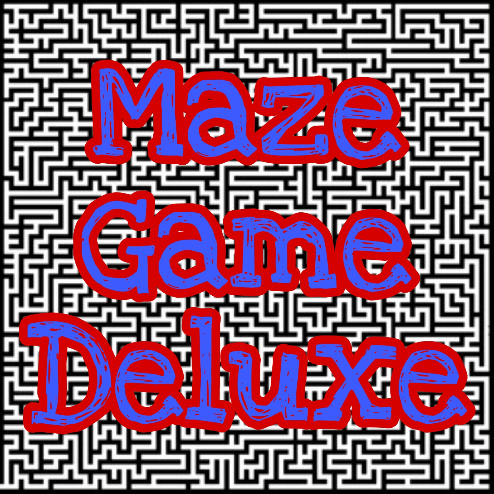

[](https://gitpod.io/#https://github.com/WeilerWebServices/Maze-Game-Deluxe)



# Maze Game Deluxe

## General info

This is a simple JavaScript game.

# Play online @ ➡ [Maze Game Deluxe](https://weilerwebservices.github.io/Maze-Game-Deluxe/)  ⬅

### Game URL ➡ https://weilerwebservices.github.io/Maze-Game-Deluxe/ ⬅ 

---

## Table of contents

* [General info](#general-info)
* [Technologies](#technologies)
* [Usage](#usage)
* [Contribution](#contribution)

---


## Technologies

Project is created with:
* HTML5
* CSS3
* JavaScript

---

## Usage

This is ***ONLY*** for personal use as a simple game. You can clone the repo with

```bash
git clone https://github.com/WeilerWebServices/Maze-Game-Deluxe.git
```

---

## Contribution

You can feel free to discuss anything that you feel could be added or updated in the issues section.

Pull requests are more than welcome!

---

[](https://gitpod.io/#https://github.com/WeilerWebServices/Maze-Game-Deluxe)
